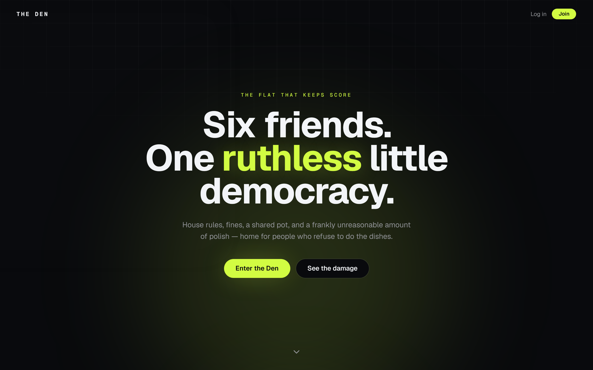
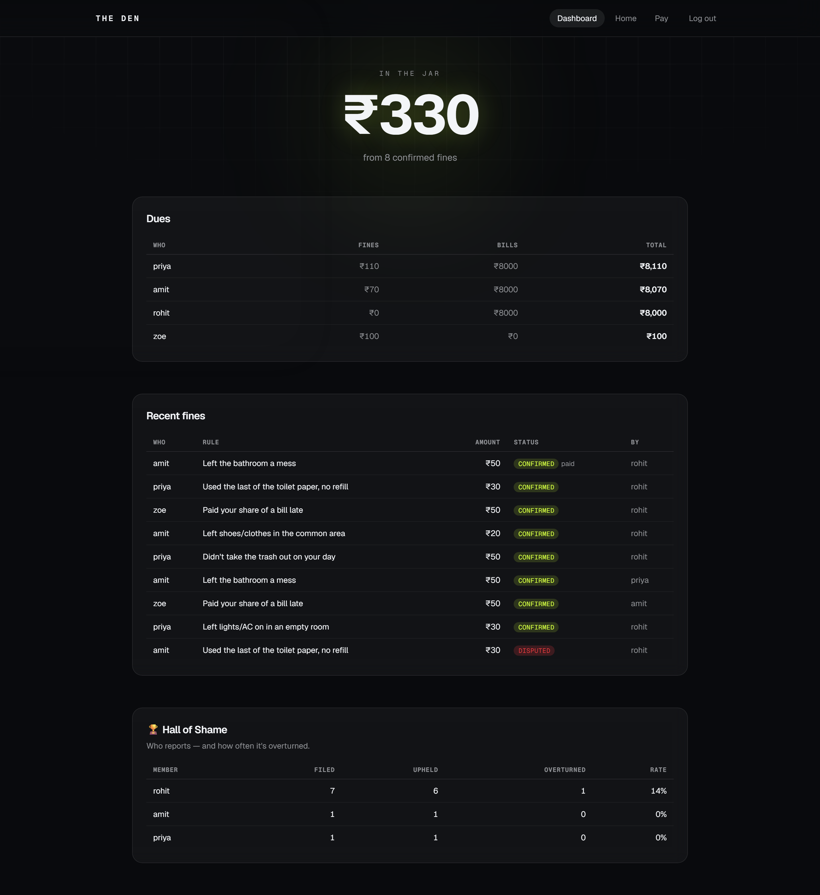
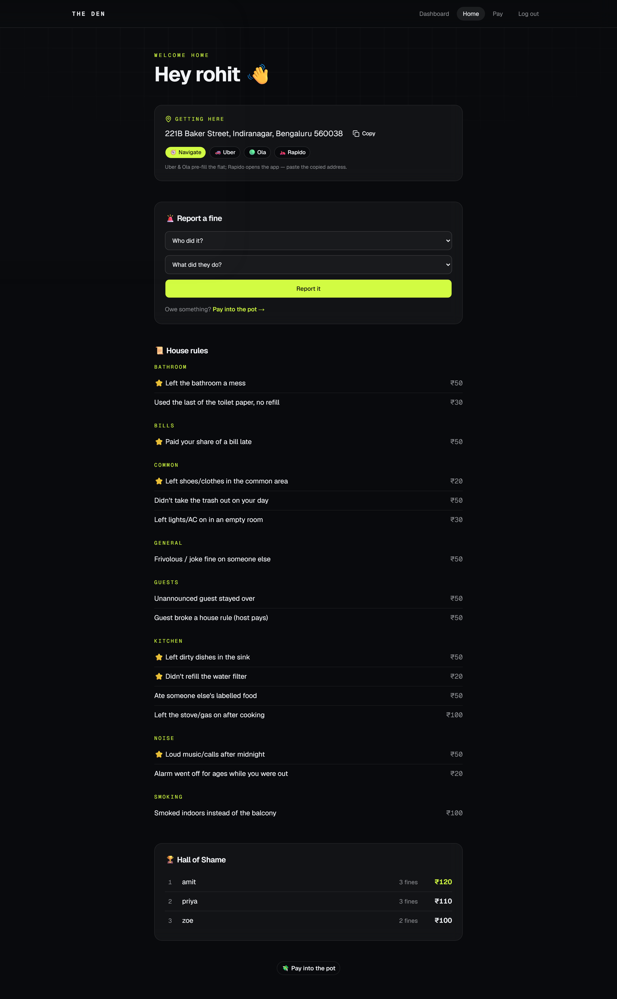
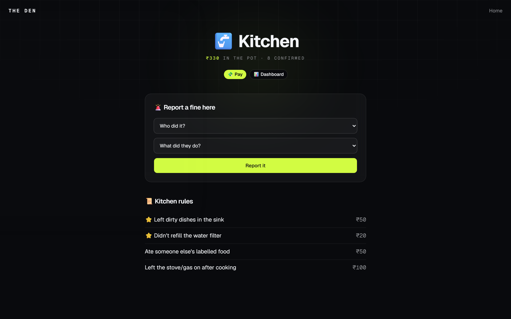

# Hive — Web (frontend)

The website for **Hive** — a shared-flat app (fines, a common "pot," bills, dues, a guest
experience, and NFC stickers). A Next.js 16 app (App Router, strict TypeScript) that
consumes the backend's JSON API. One opinionated design language, **"After Hours"**: a
near-black canvas, an acid-lime accent, glassy surfaces, glowing hero numbers, monospace
ledger details, and buttery (reduced-motion-safe) animation.

The **backend (API + Telegram bot) is a separate repo** → [vijayfagaria-dev/hive-api](https://github.com/vijayfagaria-dev/hive-api).

## A look inside

| Landing | Dashboard |
|---|---|
|  |  |

| Your hive | NFC spot |
|---|---|
|  |  |

## Stack

Next.js 16 · React 19 · TypeScript (strict) · Tailwind v4 (CSS-first `@theme`, OKLCH) ·
shadcn/ui (**Base UI**) · Framer Motion · TanStack Query v5 · Zod v4 (the API contract) ·
`next/font` (Geist + Geist Mono).

## Run

```bash
npm install
npm run dev          # → http://localhost:3000
```

The dev server **proxies `/api` → the backend** (default `http://127.0.0.1:8000`), so auth
stays same-origin (no CORS). Start the [backend](https://github.com/vijayfagaria-dev/hive-api)
first. Point it elsewhere with `API_ORIGIN`:

```bash
API_ORIGIN=http://127.0.0.1:8000 npm run dev
```

```bash
npm run build        # typecheck + production build
npm start            # serve the production build
```

## Views

`/` landing · `/login` + `/register` · `/dashboard` (tenant) · `/hive` (home) · `/pay` ·
`/s/[spot]` (the public NFC pages).

## Layout

```
.
├── src/
│   ├── app/             routes (App Router): landing, (auth), (app), s/[spot]
│   ├── components/      UI + landing/app pieces (shadcn in components/ui)
│   └── lib/             api.ts (Zod contract) · queries.ts (TanStack) · motion.ts
├── public/              static assets (drop real photos here)
└── next.config.ts       the /api → backend proxy
```

> Placeholder visuals (the room gallery, the "residents") are intentional — drop real
> photos into `public/` to replace them.

The whole product design is in **[DESIGN.md](./DESIGN.md)** (the single source of truth).
